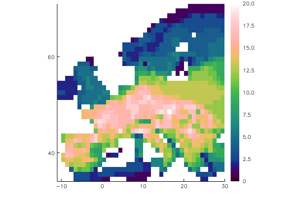
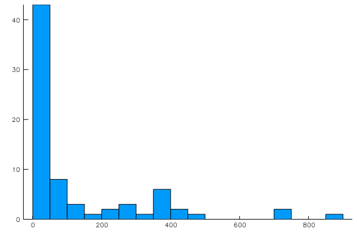
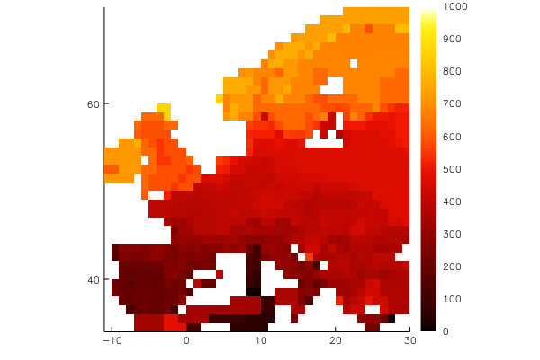

# SpatialEcology

[](https://travis-ci.org/EcoJulia/SpatialEcology.jl)

### Primary author: Michael Krabbe Borregaard (@mkborregaard)


A package for community- and macro-ecological analysis in julia.
The intention of this package is to offer a set of base types for interoperability among all types of analyses in spatial ecology. The idea is to provide a powerful framework that can express many types of analyses in a flexible manner. It presently holds types for keeping presence-absence matrices, site data and species traits together, and will be included with phylogenies and ecological interaction networks. SpatialEcology takes care of aligning all data for analysis.

The emphasis is on fast, flexible code operating mainly with views into the larger dataset. It currently holds fast, specialized code for operations on views into sparse matrices (such as presence-absence matrices). This allows analyses to be done in a split-apply-combine framework.

The package originated as a port of my R package `nodiv`, available from CRAN.

- Types:
    - Assemblage (holds presence-absence information along with information on traits and sites)
    - ComMatrix (presence-absence matrix)
    - SpatialData (Grid or Point data with site information)

## Getting started:

```julia
using SpatialEcology, Plots

# the object constructors take a wide range of objects, a typical being a presence-absence matrix as a DataFrame and a 3-column dataframe with coordinates
amphdata = readtable(joinpath(Pkg.dir("SpatialEcology"), "data", "amph_Europe.csv"));
amphdata[1:3,1:6]
    # 5×6 DataFrames.DataFrame
    # │ Row │ Long │ Lat  │ coords      │ Salamandra_salamandra │ _Calotriton_asper │ _Calotriton_arnoldi │
    # ├─────┼──────┼──────┼─────────────┼───────────────────────┼───────────────────┼─────────────────────┤
    # │ 1   │ 17.5 │ 46.5 │ "17.5_46.5" │ 1                     │ 0                 │ 0                   │
    # │ 2   │ 17.5 │ 47.5 │ "17.5_47.5" │ 1                     │ 0                 │ 0                   │
    # │ 3   │ 24.5 │ 37.5 │ "24.5_37.5" │ 1                     │ 0                 │ 0                   │

amph = Assemblage(amphdata[4:end],amphdata[1:3])
    # Matrix data assumed to be presence-absence
    # Assemblage with 73 species in 1010 sites
    #
    # Species names:
    # Salamandra_salamandra, _Calotriton_asper, _Calotriton_arnoldi...Chioglossa_lusitanica, Pleurodeles_waltl
    #
    # Site names:
    # 1, 2, 3...1009, 1010

plot(amph)
```

## Accessing and adding data:

```julia
# access functions summarize the data, such as `occupancy`, `richness`, `nsites`, `nspecies`
mean(occupancy(amph))
    # 125.15068493150685

# Add DataFrames or Vectors of data to the assemblage, DataFrames are automatically aligned keeping everything together
addtraits!(amph, occupancy(amph), :rangesize)

# and access the data easily
histogram(amph[:rangesize], grid = false, legend = false)
```


## Easy subsetting and quick views:

```julia
meanrange = map(site->mean(amph[:rangesize][occurring(amph,site)]), 1:nsites(amph))
plot(meanrange, amph, color = :fire)
```


```julia
triturus = view(amph, species = contains.(specnames(amph), "Triturus"))
    # SubAssemblage with 6 species in 1010 sites
    #
    # Species names:
    # _Triturus_marmoratus, _Triturus_pygmaeus, _Triturus_cristatus..._Triturus_karelinii_nonspl, _Triturus_dobrogicus
    #
    # Site names:
    # 1, 2, 3...1009, 1010

extrema(coordinates(triturus), 1)
    # 1×2 Array{Tuple{Float64,Float64},2}:
    #  (-10.5, 29.5)  (34.5, 70.5)
    # Triturus exists between latitudes 34 and 71 in Europe
```
